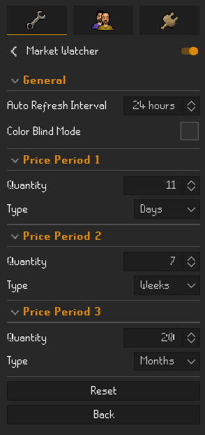
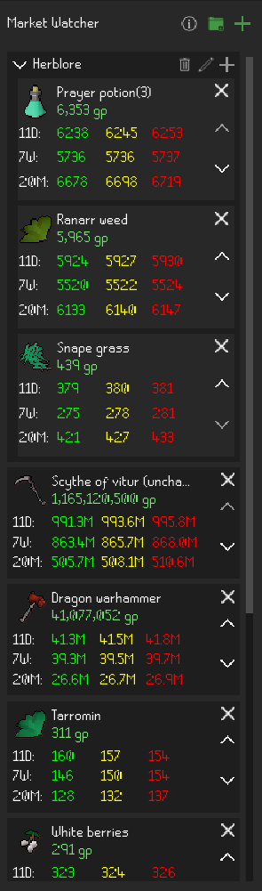

# Market Watcher Plugin

Watches market prices of items using OSRS Wiki Prices: https://prices.runescape.wiki/osrs/.

## Usage

Search for items to track and optionally add items to tabs to group them together.

Each item displays prices for three time periods up to the current date:

Default Time Periods:
- 1 Week
- 1 Month
- 3 Months

### Configuration
- Increase or decrease the interval at which the item price data is automatically refreshed
  - Minimum Value: 6 Hours
  - Maximum Value: 24 Hours
- Colorblind Mode
  - Changes the price colors to be more colorblind friendly.
- Configure each of the three time periods to be days, weeks or months.
  - Minimum Values: 1 Day, 1 Week, or 1 Month
  - Maximum Values: 24 Days, 24 Weeks, or 24 Months

### Color Legend
| Price Type | Color     |
|------------|-----------|
| Low        | Green 🟢  |
| Medium     | Yellow 🟡 |
| High       | Red 🔴    |

### Color Legend (Colorblind Mode)

| Price Type |       Color        |
|------------|--------------------|
| Low        | rgb(136, 204, 238) |
| Medium     | rgb(221, 204, 119) |
| High       | rgb(170, 68, 153)  |

### Sample Panel Images

