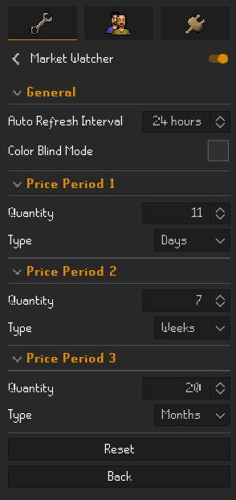
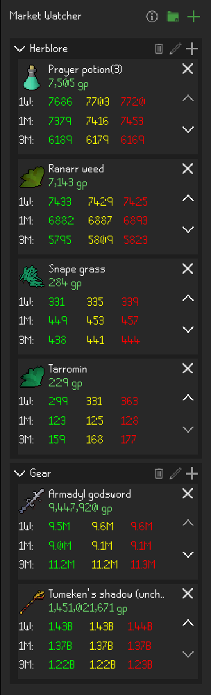
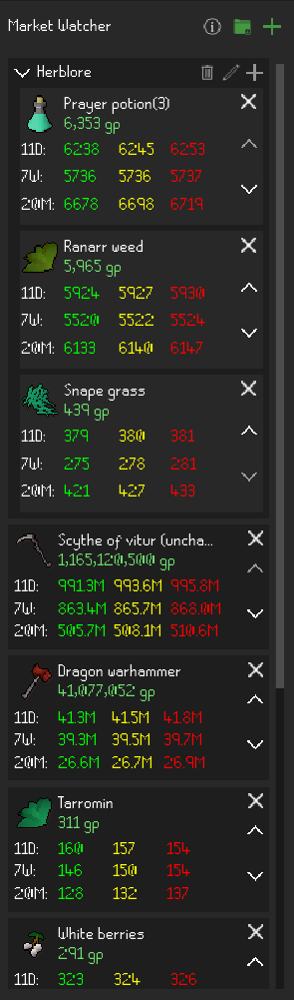

# Market Watcher Plugin

Watches market prices of items using OSRS Wiki Prices: https://prices.runescape.wiki/osrs/.

## Usage

Search for items to track and optionally add items to tabs to group them together.

Each item displays its current Grand Exchange price, plus the wiki's average low, medium, and high prices from three points in the past. Each of these is the average over a 6-hour window, not a range across the whole period.

Default Time Periods:
- 1 Day ago
- 3 Weeks ago
- 3 Months ago

Hover over a price to see its exact value. Click an item's icon to open its page on the OSRS Wiki prices site.

### Configuration
- Increase or decrease the interval at which the item price data is automatically refreshed
  - Minimum Value: 6 Hours
  - Maximum Value: 24 Hours
- Colorblind Mode
  - Changes the price colors to be more colorblind friendly.
- Configure each of the three time periods to be days, weeks or months.
  - Minimum Values: 1 Day, 1 Week, or 1 Month
  - Maximum Values: 24 Days, 24 Weeks, or 24 Months

### Color Legend
| Price Type | Color     |
|------------|-----------|
| Low        | Green 🟢  |
| Medium     | Yellow 🟡 |
| High       | Red 🔴    |

### Color Legend (Colorblind Mode)

| Price Type |       Color        |
|------------|--------------------|
| Low        | rgb(136, 204, 238) |
| Medium     | rgb(221, 204, 119) |
| High       | rgb(170, 68, 153)  |

### Sample Panel Images

