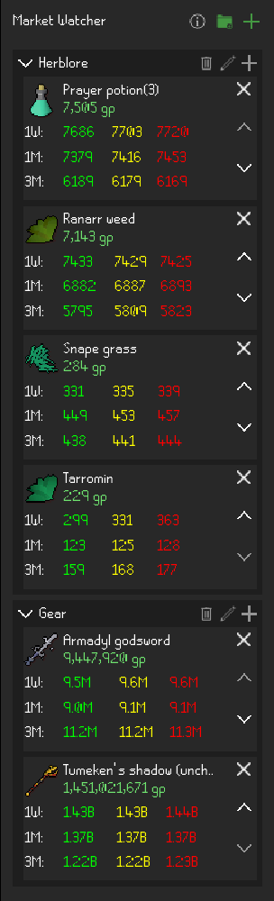

# Market Watcher Plugin

Watches market prices of items using OSRS Wiki Prices: https://prices.runescape.wiki/osrs/.

## Usage

Search for items to track and optionally add items to tabs to group them together.

Each item displays prices for the following time periods up to the current date:

- 1 Week
- 1 Month
- 3 Months

### Color Legend

| Price Type | Color     |
|------------|-----------|
| Low        | Green 🟢  |
| Medium     | Yellow 🟡 |
| High       | Red 🔴    |

### Sample Panel Image

